<<<<<<< Updated upstream
# Forum Project

Un forum moderne et interactif développé avec Node.js, Express et SQLite.

## Architecture Technique

### Diagramme d'Architecture Global

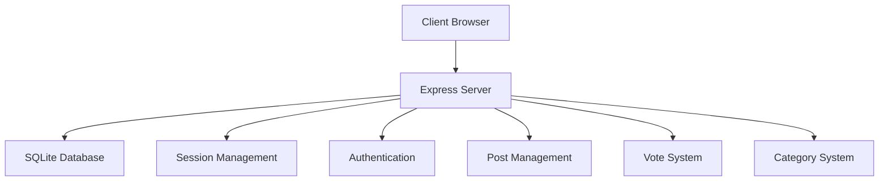

### Gestion des Sessions et Authentification

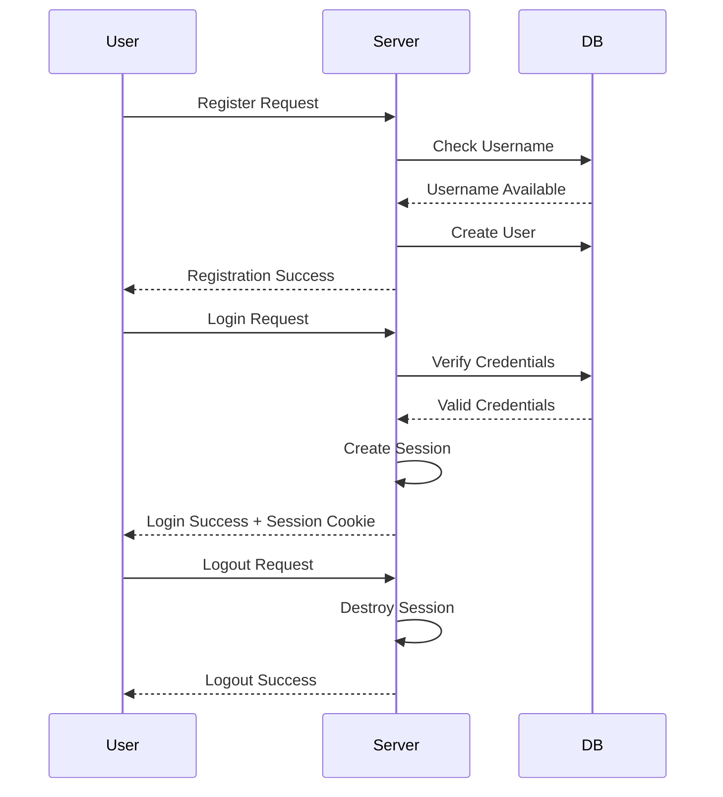

### Gestion des Posts

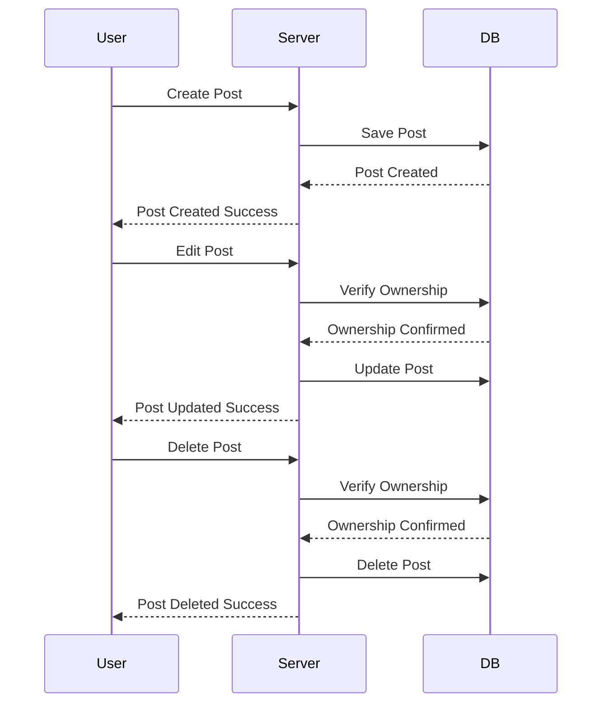

### Système de Votes

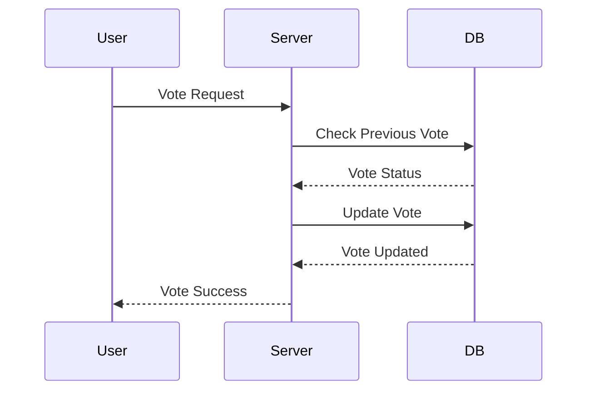

### Structure de la Base de Données

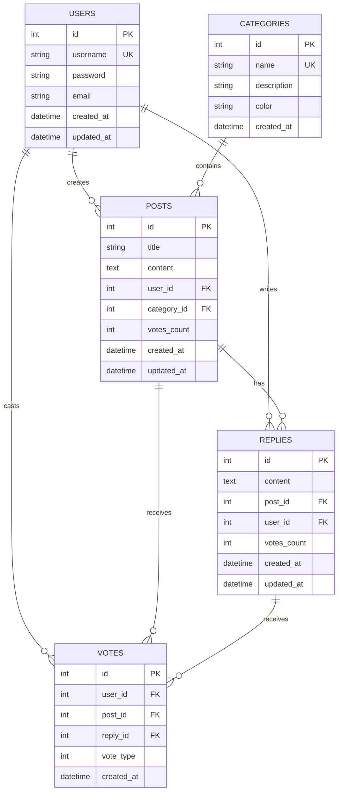

### Architecture des Modules

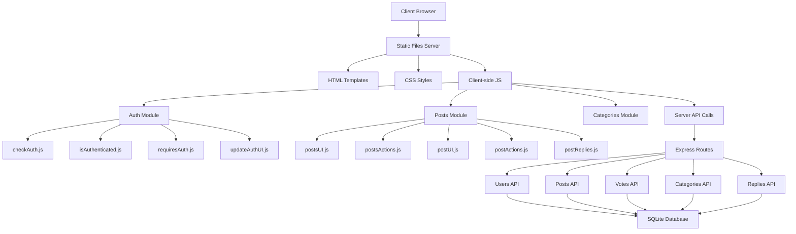

### Flux de Navigation et Routing

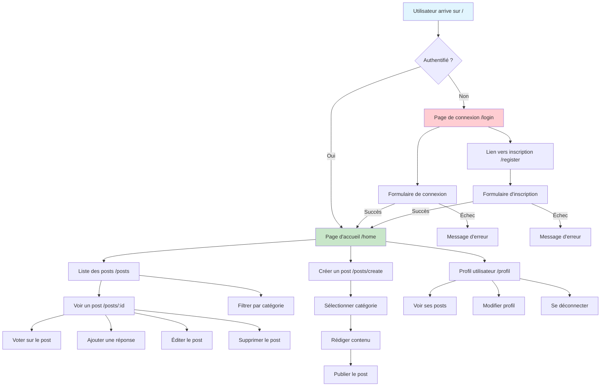

### Système de Gestion des Erreurs

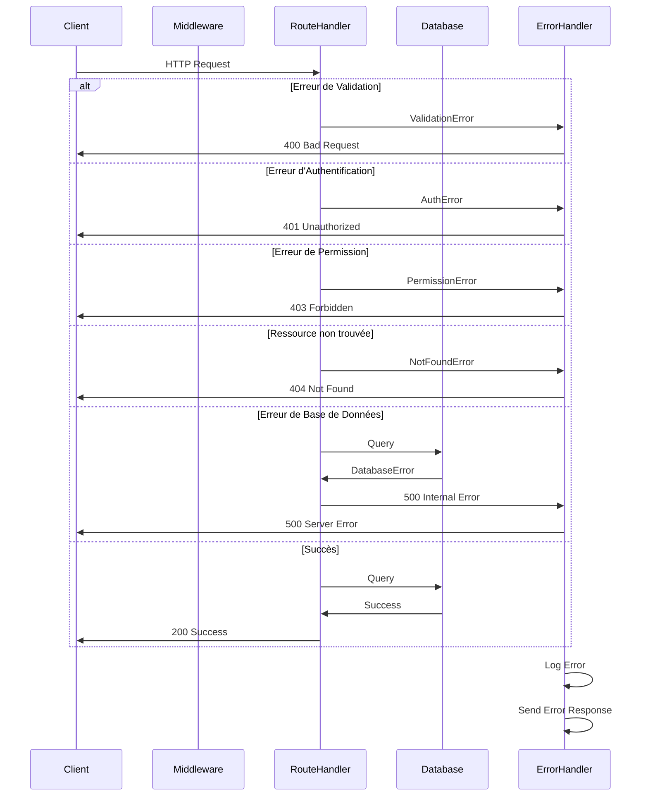

### Architecture de Déploiement Docker

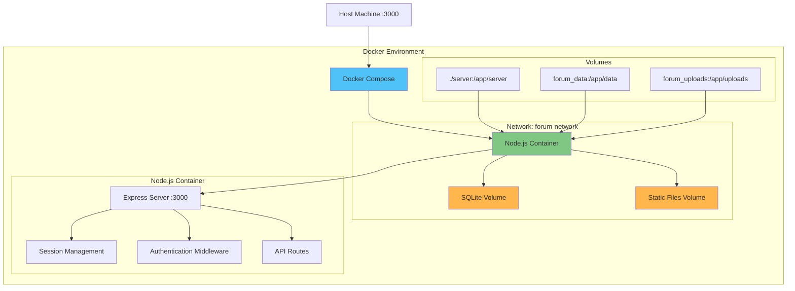

### Gestion des Catégories et Filtrage

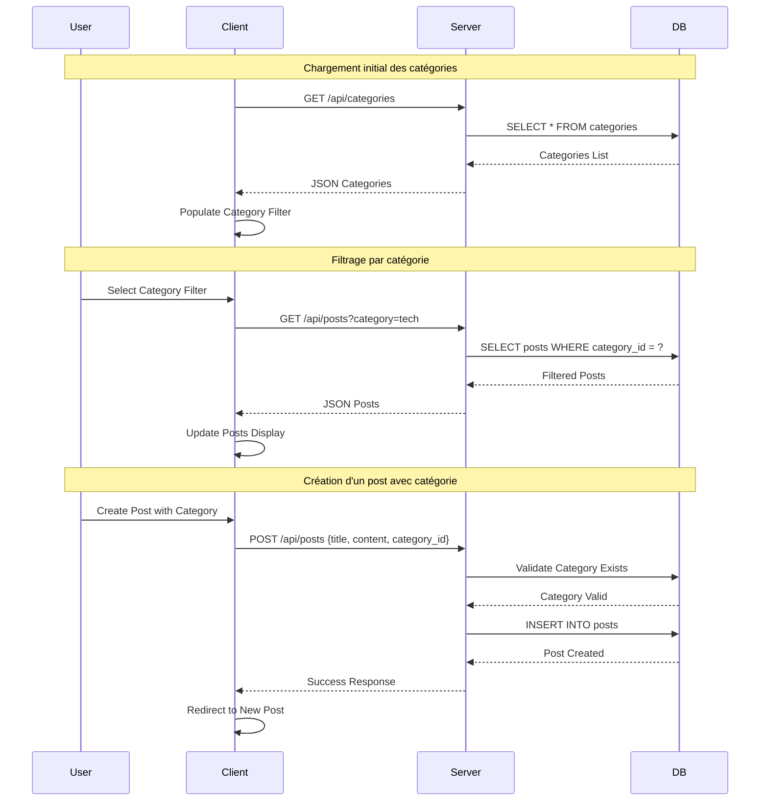

### Système de Réponses et Threading

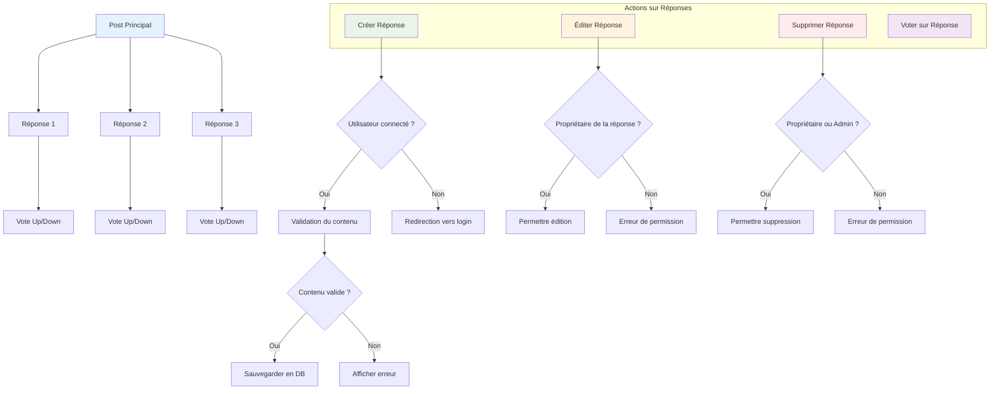

## Fonctionnalités Détaillées

### 1. Gestion des Sessions et Cookies (1 point)

- Utilisation de `express-session` pour la gestion des sessions
- Stockage des sessions en mémoire avec possibilité de persistance
- Cookies sécurisés avec options httpOnly et secure
- Gestion des timeouts de session

### 2. Identification Sécurisée (1 point)

- Inscription avec validation des données
- Connexion avec hachage des mots de passe (bcrypt)
- Déconnexion avec destruction de session
- Protection contre les attaques CSRF
- Validation des entrées utilisateur

### 3. Création de Posts (1.75 points)

- Création de posts pour utilisateurs connectés
- Système de catégories obligatoire
- Validation des données
- Support du markdown
- Gestion des erreurs

### 4. Édition des Posts (1 point)

- Édition des posts par leurs auteurs
- Suppression des posts
- Historique des modifications
- Validation des permissions

### 5. Base de Données (1 point)

- Utilisation de SQLite
- Schéma optimisé
- Requêtes préparées
- Gestion des transactions
- Indexation appropriée

### 6. Routing Erreur Web + RGPD (0.5 point)

- Gestion globale des erreurs avec middleware Express
- Page d'erreur 404 personnalisée
- Politique de confidentialité conforme RGPD
- Gestion des cookies et des données personnelles
- Droits des utilisateurs (accès, rectification, effacement)

### 7. Système de Votes (0.5 point)

- Upvote/Downvote
- Un vote par utilisateur
- Mise à jour en temps réel
- Calcul des scores

### 7. Vérification d'Authentification (1 point)
- Redirection automatique vers la page de connexion
- Protection des routes nécessitant une authentification
- Gestion des sessions avec express-session
- Middleware de vérification d'authentification
- Gestion des requêtes AJAX/API

### 8. Syntaxe SQL (0.5 point)

- Requêtes optimisées
- Jointures appropriées
- Sous-requêtes
- Agrégations

### 9. Gestion des Versions (0.5 point)

- Utilisation de Git
- Branches thématiques :
  - `main` : Version stable
  - `test` : Tests et développement
  - `docker` : Configuration Docker
  - `main-css` : Styles
  - `main-html` : Templates
  - `main-js` : Logique JavaScript
  - `readme` : Documentation
- Commits atomiques et descriptifs

### 10. Qualité du Code (0.5 point)

- Code modulaire
- Documentation claire
- Tests unitaires
- Gestion des erreurs

### 11. Nomenclature (0.75 point)

- Conventions de nommage cohérentes
- Variables descriptives
- Fonctions avec responsabilité unique
- Commentaires pertinents

### 12. Organisation des Fichiers (1 point)

- Structure modulaire
- Séparation des responsabilités
- Architecture MVC
- Gestion des dépendances

### 13. Docker (1.5 points - Bonus)

- Containerisation complète
- Multi-stage builds
- Volumes persistants
- Réseau isolé
- Variables d'environnement

## Prérequis

### Installation de WSL (Windows Subsystem for Linux)

1. Ouvrir PowerShell en tant qu'administrateur et exécuter :

```powershell
wsl --install
```

2. Redémarrer votre ordinateur

3. Après le redémarrage, WSL s'installera automatiquement et vous demandera de créer un nom d'utilisateur et un mot de passe pour votre distribution Linux

4. Vérifier l'installation :

```powershell
wsl --list --verbose
```

### Installation de Docker

#### Sur Windows

1. Télécharger Docker Desktop depuis [le site officiel](https://www.docker.com/products/docker-desktop)
2. Installer Docker Desktop
3. Lors de l'installation, cocher l'option "Use WSL 2 instead of Hyper-V"
4. Redémarrer votre ordinateur
5. Vérifier l'installation :

```powershell
docker --version
docker compose version
docker compose version
```

#### Sur Ubuntu (WSL)

1. Mettre à jour les paquets :

```bash
sudo apt update && sudo apt upgrade
```

2. Installer les prérequis :

```bash
sudo apt install -y apt-transport-https ca-certificates curl software-properties-common
```

3. Ajouter la clé GPG officielle de Docker :

```bash
curl -fsSL https://download.docker.com/linux/ubuntu/gpg | sudo apt-key add -
```

4. Ajouter le dépôt Docker :

```bash
sudo add-apt-repository "deb [arch=amd64] https://download.docker.com/linux/ubuntu $(lsb_release -cs) stable"
```

5. Installer Docker :

```bash
sudo apt update
sudo apt install -y docker-ce docker-ce-cli containerd.io docker-compose-plugin
```

6. Ajouter votre utilisateur au groupe docker :

```bash
sudo usermod -aG docker $USER
```

7. Redémarrer WSL ou votre session :

```bash
wsl --shutdown
```

8. Vérifier l'installation :

```bash
docker --version
docker compose version
```

## Structure du Projet

```
.
├── server/
│   ├── css/
│   │   └── style.css          # Styles globaux
│   ├── html/                  # Templates HTML
│   │   ├── home.html         # Page d'accueil
│   │   ├── login.html        # Page de connexion
│   │   ├── password.html     # Gestion des mots de passe
│   │   ├── post.html         # Affichage d'un post
│   │   ├── posts.html        # Liste des posts
│   │   ├── profil.html       # Page de profil
│   │   └── register.html     # Page d'inscription
│   └── js/
│       ├── index/            # Scripts principaux
│       │   ├── auth/         # Module d'authentification
│       │   │   ├── checkAuth.js
│       │   │   ├── index.js
│       │   │   ├── isAuthenticated.js
│       │   │   ├── requiresAuth.js
│       │   │   └── updateAuthUI.js
│       │   ├── auth.js       # Gestion principale de l'authentification
│       │   ├── login.js      # Gestion de la connexion
│       │   ├── post.js       # Gestion d'un post individuel
│       │   ├── posts.js      # Gestion de la liste des posts
│       │   └── profil.js     # Gestion du profil
│       ├── modules/          # Modules modulaires
│       │   └── posts/        # Module de gestion des posts (Architecture Optimisée)
│       │       ├── index.js          # Point d'entrée centralisé pour tous les exports
│       │       ├── posts.js          # Orchestrateur principal et initialisation
│       │       ├── postActions.js    # Actions utilisateur optimisées (create, edit, delete)
│       │       ├── postApi.js        # Fonctions API centralisées
│       │       ├── postValidation.js # Validation et sanitisation des données
│       │       ├── postVotes.js      # Système de votes modulaire
│       │       ├── postDOMUtils.js   # Utilitaires de manipulation DOM
│       │       ├── postsUI.js        # Génération des composants UI
│       │       ├── post.js           # Gestion d'un post individuel
│       │       ├── postReplies.js    # Gestion des réponses
│       │       ├── postUI.js         # Interface utilisateur d'un post
│       │       └── postsActions.js   # Actions sur la liste des posts
│       ├── categories.js     # Gestion des catégories
│       ├── database.js       # Configuration de la base de données
│       ├── posts.js          # API des posts
│       ├── replies.js        # Gestion des réponses
│       ├── startServer.js    # Démarrage du serveur
│       ├── users.js          # Gestion des utilisateurs
│       └── votes.js          # Système de votes
```

## Fonctionnalités Principales

### Authentification

- Inscription et connexion des utilisateurs
- Gestion des sessions
- Protection des routes
- Mise à jour de l'interface en fonction de l'état de connexion

### Posts

- Création, édition et suppression de posts
- Catégorisation des posts
- Système de votes (upvote/downvote)
- Gestion des réponses
- Filtrage par catégorie

### Interface Utilisateur

- Design responsive
- Feedback utilisateur en temps réel
- Navigation intuitive
- Gestion des erreurs

## Organisation du Code

### Structure Modulaire

Le projet utilise une architecture modulaire pour une meilleure maintenabilité :

1. **Module d'Authentification** (`/js/index/auth/`)

   - Séparation des responsabilités d'authentification
   - Gestion des états de connexion
   - Protection des routes

2. **Module des Posts Optimisé** (`/js/modules/posts/`)
   - Architecture modulaire avancée suivant le principe de responsabilité unique
   - Séparation complète des préoccupations (API, Validation, UI, Actions)
   - Facilité de maintenance et de test
   - Réutilisabilité des composants

#### Architecture Détaillée du Module Posts

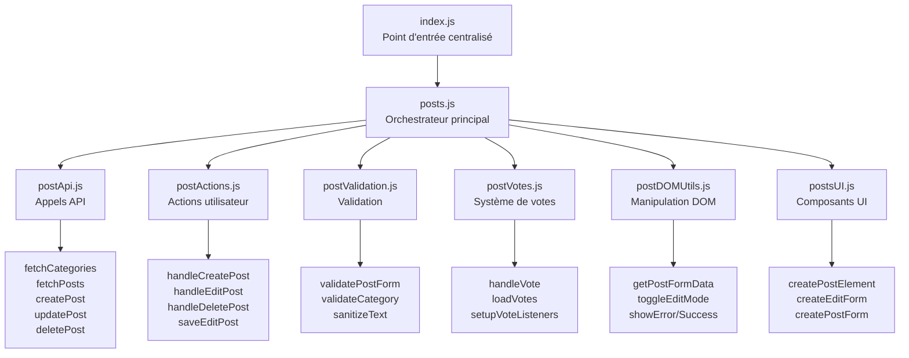

#### Séparation des Responsabilités

- **`index.js`** : Point d'entrée centralisé qui exporte toutes les fonctions des modules
- **`posts.js`** : Orchestrateur principal qui coordonne l'initialisation et la gestion d'état
- **`postApi.js`** : Gestion centralisée de tous les appels API (REST)
- **`postActions.js`** : Actions utilisateur optimisées avec validation intégrée
- **`postValidation.js`** : Validation et sanitisation des données utilisateur
- **`postVotes.js`** : Système de votes modulaire et autonome
- **`postDOMUtils.js`** : Utilitaires de manipulation DOM réutilisables
- **`postsUI.js`** : Génération des composants UI (templates HTML)

#### Avantages de cette Architecture

1. **Maintenance** : Chaque fichier a une responsabilité claire et limitée
2. **Testabilité** : Modules indépendants faciles à tester unitairement
3. **Réutilisabilité** : Fonctions exportées réutilisables dans d'autres modules
4. **Évolutivité** : Ajout facile de nouvelles fonctionnalités
5. **Lisibilité** : Code mieux organisé et documenté
6. **Performance** : Chargement modulaire et optimisations possibles

### Base de Données

- SQLite pour la persistance des données
- Tables : users, posts, categories, replies, votes

### API REST

- Routes pour l'authentification
- Gestion des posts et réponses
- Système de votes
- Gestion des catégories

## Installation du Projet

1. Cloner le repository

```bash
git clone https://github.com/guiiireg/forum.git
```

2. Installer les dépendances

```bash
npm install
```

## Démarrage du Projet

### Avec Docker (Recommandé)

1. Se placer dans le répertoire du projet

```bash
cd forum
```

2. Lancer les conteneurs

```bash
docker compose down && docker compose build && docker compose up -d
```

Cette commande va :

- Arrêter les conteneurs existants (`down`)
- Reconstruire les images (`build`)
- Démarrer les conteneurs en arrière-plan (`up -d`)

3. Vérifier que les conteneurs sont en cours d'exécution

```bash
docker compose ps
```

4. Accéder au forum
   Ouvrir votre navigateur et aller à `http://localhost:3000`

### Commandes Docker utiles

- Voir les logs des conteneurs :

```bash
docker compose logs -f
```

- Arrêter les conteneurs :

```bash
docker compose down
```

- Reconstruire et redémarrer les conteneurs :

```bash
docker compose up -d --build
```

- Voir l'utilisation des ressources :

```bash
docker stats
```

### Sans Docker

1. Démarrer le serveur

```bash
node server/js/startServer.js
```

2. Accéder au forum
   Ouvrir votre navigateur et aller à `http://localhost:3000`

## Dépendances Principales

- express: ^5.1.0
- sqlite3: ^5.1.7
- dotenv: ^16.5.0

## Développement

### Branches

- `main` : Version stable
- `test` : Tests et développement
- `docker` : Configuration Docker
- `main-css` : Styles
- `main-html` : Templates
- `main-js` : Logique JavaScript

### Conventions de Code

- Modules ES6
- Architecture modulaire
- Séparation UI/Logique
- Commentaires explicatifs
=======
# Forum Project

Un forum moderne et interactif développé avec Node.js, Express et SQLite.

## Documentation

- [Architecture Technique](docs/architecture.md) - Diagrammes et architecture du projet
- [Fonctionnalités](docs/features.md) - Liste détaillée des fonctionnalités
- [Installation](docs/installation.md) - Guide d'installation et prérequis
- [Développement](docs/development.md) - Guide de développement et conventions
- [Structure](docs/structure.md) - Structure détaillée du projet

## Vue d'ensemble

Le Forum Project est une application web moderne avec architecture **ultra-modulaire** offrant :
- **Architecture hyper-modulaire** : 40+ modules spécialisés
- **Performance optimisée** : Réductions de code massives (-96% global)
- **Authentification sécurisée** et gestion des sessions
- **Gestion avancée des posts** avec 8 modules ultra-spécialisés
- **Système de votes** dynamique et réactif
- **Interface responsive** avec feedback temps réel
- **Filtres avancés** (catégories, date, popularité)
- **Base de données modulaire** avec 6 modules dédiés

## Démarrage Rapide

1. Cloner le repository

```bash
git clone https://github.com/guiiireg/forum.git
```

2. Installer les dépendances

```bash
npm install
```

3. Démarrer avec Docker (recommandé)
```bash
docker compose up -d
```

4. Ou démarrer sans Docker
```bash
node server/js/startServer.js
```

5. Accéder à l'application : `http://localhost:3000`

Pour plus de détails, consultez la [documentation complète](docs/installation.md).

## Optimisations Réalisées

### Architecture Ultra-Modulaire
- **database.js** : 215 → 8 lignes (-96%)
- **startServer.js** : 481 → 11 lignes (-98%)
- **posts module** : 718 → 42 lignes (-94%)
- **postRoutes.js** : 227 → 9 lignes (-96%)

### Résultat Global
- **Total** : 1641 → 70 lignes (-96% de réduction)
- **40+ modules spécialisés** créés
- **Aucun fichier > 227 lignes**
- **Architecture hyper-modulaire** avec orchestrateurs légers

### Modules Frontend Posts (8 modules)
- `postsState.js` - Gestion d'état centralisée (67 lignes)
- `postsDataLoader.js` - Chargement des données (61 lignes) 
- `postsFilter.js` - Filtrage et tri (47 lignes)
- `postsDisplay.js` - Génération UI (115 lignes)
- `postsVoting.js` - Système de vote (78 lignes)
- `postsActions.js` - Actions CRUD (227 lignes)
- `postsEventHandlers.js` - Gestionnaires d'événements (48 lignes)
- `index.js` - **Orchestrateur principal (42 lignes)**
>>>>>>> Stashed changes
