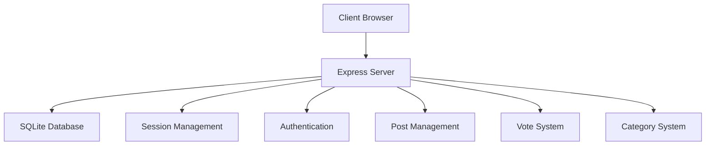
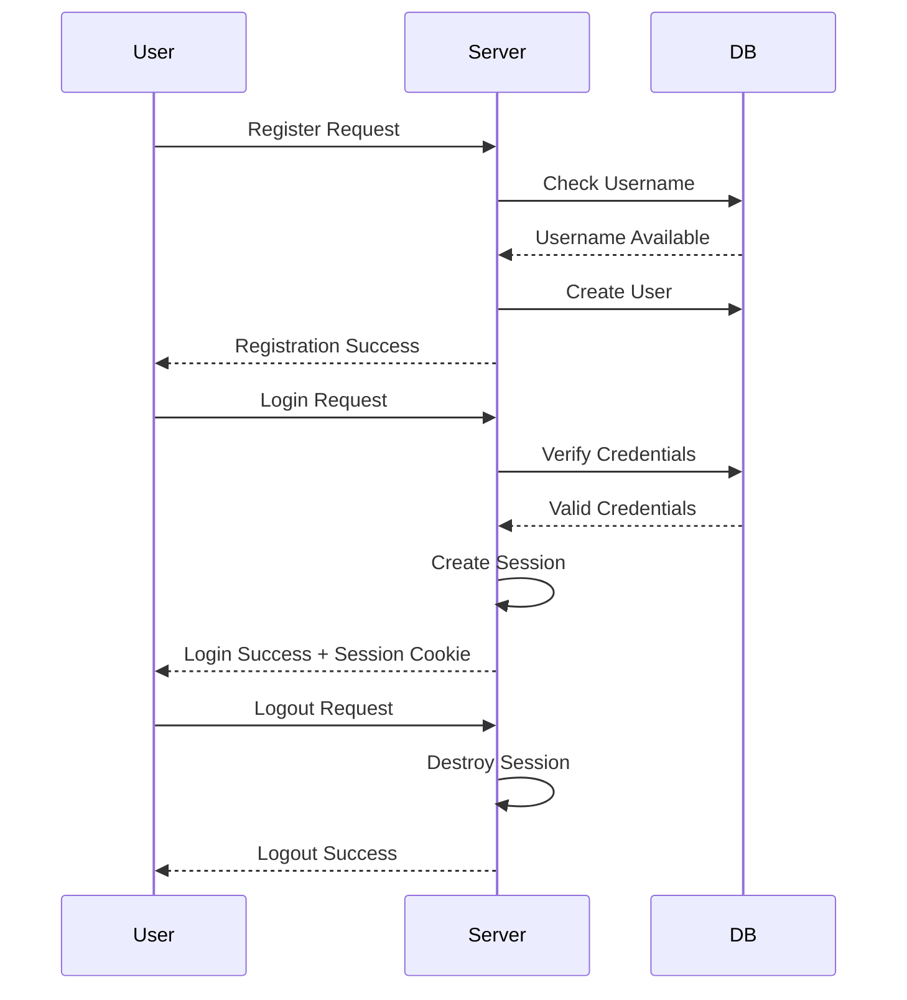
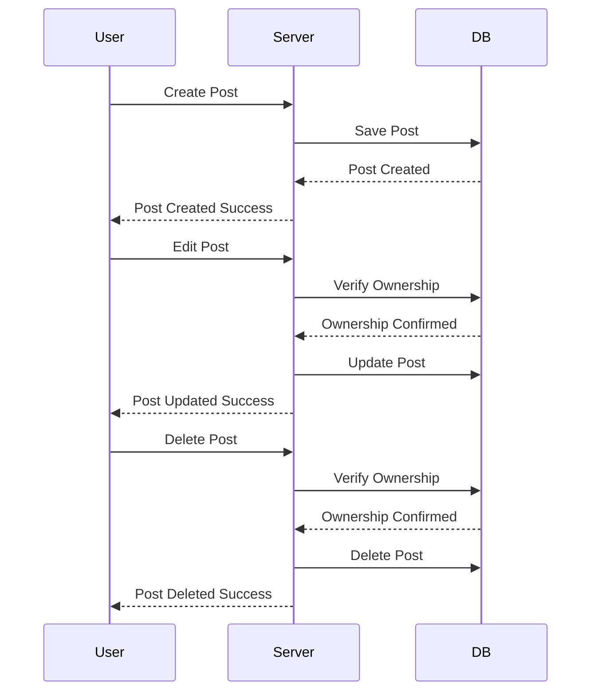
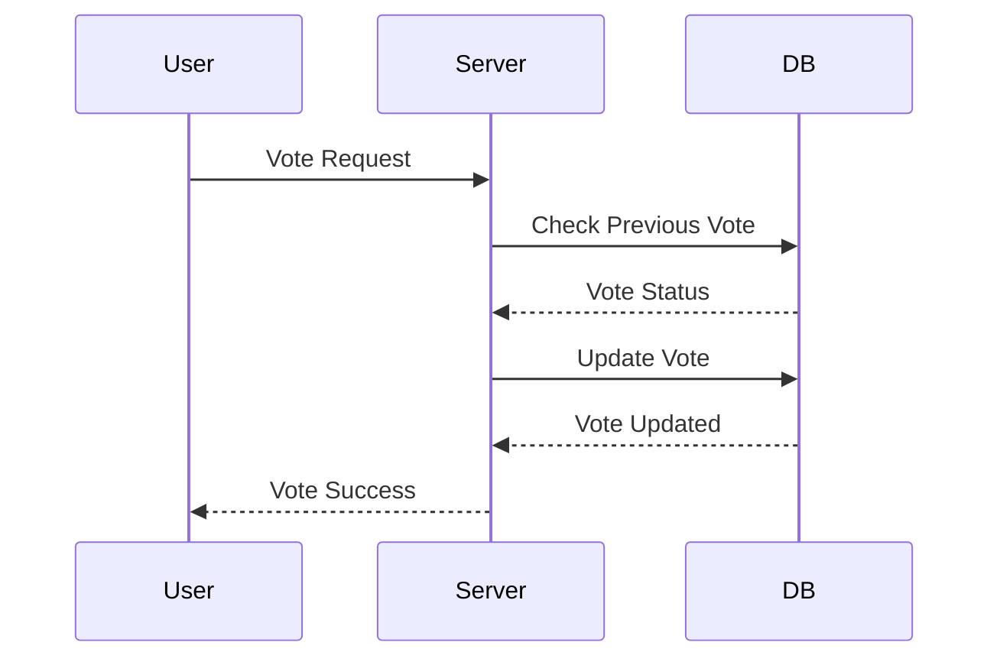
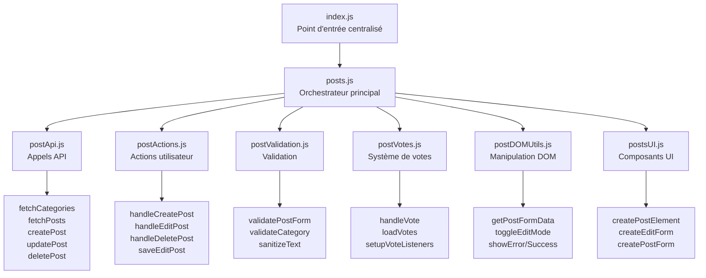

# Forum Project

Un forum moderne et interactif développé avec Node.js, Express et SQLite.

## Architecture Technique

### Diagramme d'Architecture Global


### Gestion des Sessions et Authentification


### Gestion des Posts


### Système de Votes


## Fonctionnalités Détaillées

### 1. Gestion des Sessions et Cookies (1 point)
- Utilisation de `express-session` pour la gestion des sessions
- Stockage des sessions en mémoire avec possibilité de persistance
- Cookies sécurisés avec options httpOnly et secure
- Gestion des timeouts de session

### 2. Identification Sécurisée (1 point)
- Inscription avec validation des données
- Connexion avec hachage des mots de passe (bcrypt)
- Déconnexion avec destruction de session
- Protection contre les attaques CSRF
- Validation des entrées utilisateur

### 3. Création de Posts (1.75 points)
- Création de posts pour utilisateurs connectés
- Système de catégories obligatoire
- Validation des données
- Support du markdown
- Gestion des erreurs

### 4. Édition des Posts (1 point)
- Édition des posts par leurs auteurs
- Suppression des posts
- Historique des modifications
- Validation des permissions

### 5. Base de Données (1 point)
- Utilisation de SQLite
- Schéma optimisé
- Requêtes préparées
- Gestion des transactions
- Indexation appropriée

### 6. Routing Erreur Web + RGPD (0.5 point)
- Gestion globale des erreurs avec middleware Express
- Page d'erreur 404 personnalisée
- Politique de confidentialité conforme RGPD
- Gestion des cookies et des données personnelles
- Droits des utilisateurs (accès, rectification, effacement)

### 7. Système de Votes (0.5 point)
- Upvote/Downvote
- Un vote par utilisateur
- Mise à jour en temps réel
- Calcul des scores

### 7. Vérification d'Authentification (1 point)
- Redirection automatique vers la page de connexion
- Protection des routes nécessitant une authentification
- Gestion des sessions avec express-session
- Middleware de vérification d'authentification
- Gestion des requêtes AJAX/API

### 8. Syntaxe SQL (0.5 point)
- Requêtes optimisées
- Jointures appropriées
- Sous-requêtes
- Agrégations

### 9. Gestion des Versions (0.5 point)
- Utilisation de Git avec workflow optimisé
- Branches thématiques :
  - `main` : Version stable
  - `test` : Tests et développement
  - `docker` : Configuration Docker
  - `main-css` : Styles
  - `main-html` : Templates
  - `main-js` : Logique JavaScript optimisée (architecture modulaire)
  - `readme` : Documentation mise à jour
- Commits atomiques et descriptifs avec convention :
  - `[REFACTOR]` : Restructuration du code
  - `[ADD]` : Nouvelles fonctionnalités
  - `[FIX]` : Corrections de bugs
  - `[UPDATE]` : Mises à jour
  - `[DOCS]` : Documentation

### 10. Qualité du Code (0.5 point)
### 10. Qualité du Code (0.5 point)
- Code modulaire
- Documentation claire
- Tests unitaires
- Gestion des erreurs

### 11. Nomenclature (0.75 point)
### 11. Nomenclature (0.75 point)
- Conventions de nommage cohérentes
- Variables descriptives
- Fonctions avec responsabilité unique
- Commentaires pertinents

### 12. Organisation des Fichiers (1 point)
### 12. Organisation des Fichiers (1 point)
- Structure modulaire
- Séparation des responsabilités
- Architecture MVC
- Gestion des dépendances

### 13. Docker (1.5 points - Bonus)
### 13. Docker (1.5 points - Bonus)
- Containerisation complète
- Multi-stage builds
- Volumes persistants
- Réseau isolé
- Variables d'environnement

## Prérequis

### Installation de WSL (Windows Subsystem for Linux)

1. Ouvrir PowerShell en tant qu'administrateur et exécuter :
```powershell
wsl --install
```

2. Redémarrer votre ordinateur

3. Après le redémarrage, WSL s'installera automatiquement et vous demandera de créer un nom d'utilisateur et un mot de passe pour votre distribution Linux

4. Vérifier l'installation :
```powershell
wsl --list --verbose
```

### Installation de Docker

#### Sur Windows
1. Télécharger Docker Desktop depuis [le site officiel](https://www.docker.com/products/docker-desktop)
2. Installer Docker Desktop
3. Lors de l'installation, cocher l'option "Use WSL 2 instead of Hyper-V"
4. Redémarrer votre ordinateur
5. Vérifier l'installation :
```powershell
docker --version
docker compose version
docker compose version
```

#### Sur Ubuntu (WSL)
1. Mettre à jour les paquets :
```bash
sudo apt update && sudo apt upgrade
```

2. Installer les prérequis :
```bash
sudo apt install -y apt-transport-https ca-certificates curl software-properties-common
```

3. Ajouter la clé GPG officielle de Docker :
```bash
curl -fsSL https://download.docker.com/linux/ubuntu/gpg | sudo apt-key add -
```

4. Ajouter le dépôt Docker :
```bash
sudo add-apt-repository "deb [arch=amd64] https://download.docker.com/linux/ubuntu $(lsb_release -cs) stable"
```

5. Installer Docker :
```bash
sudo apt update
sudo apt install -y docker-ce docker-ce-cli containerd.io docker-compose-plugin
```

6. Ajouter votre utilisateur au groupe docker :
```bash
sudo usermod -aG docker $USER
```

7. Redémarrer WSL ou votre session :
```bash
wsl --shutdown
```

8. Vérifier l'installation :
```bash
docker --version
docker compose version
```

## Structure du Projet

```
.
├── server/
│   ├── css/
│   │   └── style.css          # Styles globaux
│   ├── html/                  # Templates HTML
│   │   ├── home.html         # Page d'accueil
│   │   ├── login.html        # Page de connexion
│   │   ├── password.html     # Gestion des mots de passe
│   │   ├── post.html         # Affichage d'un post
│   │   ├── posts.html        # Liste des posts
│   │   ├── profil.html       # Page de profil
│   │   └── register.html     # Page d'inscription
│   └── js/
│       ├── index/            # Scripts principaux
│       │   ├── auth/         # Module d'authentification
│       │   │   ├── checkAuth.js
│       │   │   ├── index.js
│       │   │   ├── isAuthenticated.js
│       │   │   ├── requiresAuth.js
│       │   │   └── updateAuthUI.js
│       │   ├── auth.js       # Gestion principale de l'authentification
│       │   ├── login.js      # Gestion de la connexion
│       │   ├── post.js       # Gestion d'un post individuel
│       │   ├── posts.js      # Gestion de la liste des posts
│       │   └── profil.js     # Gestion du profil
│       ├── modules/          # Modules modulaires
│       │   └── posts/        # Module de gestion des posts (Architecture Optimisée)
│       │       ├── index.js          # Point d'entrée centralisé pour tous les exports
│       │       ├── posts.js          # Orchestrateur principal et initialisation
│       │       ├── postActions.js    # Actions utilisateur optimisées (create, edit, delete)
│       │       ├── postApi.js        # Fonctions API centralisées
│       │       ├── postValidation.js # Validation et sanitisation des données
│       │       ├── postVotes.js      # Système de votes modulaire
│       │       ├── postDOMUtils.js   # Utilitaires de manipulation DOM
│       │       ├── postsUI.js        # Génération des composants UI
│       │       ├── post.js           # Gestion d'un post individuel
│       │       ├── postReplies.js    # Gestion des réponses
│       │       ├── postUI.js         # Interface utilisateur d'un post
│       │       └── postsActions.js   # Actions sur la liste des posts
│       ├── categories.js     # Gestion des catégories
│       ├── database.js       # Configuration de la base de données
│       ├── posts.js          # API des posts
│       ├── replies.js        # Gestion des réponses
│       ├── startServer.js    # Démarrage du serveur
│       ├── users.js          # Gestion des utilisateurs
│       └── votes.js          # Système de votes
```

## Fonctionnalités Principales

### Authentification
- Inscription et connexion des utilisateurs
- Gestion des sessions
- Protection des routes
- Mise à jour de l'interface en fonction de l'état de connexion

### Posts
- Création, édition et suppression de posts
- Catégorisation des posts
- Système de votes (upvote/downvote)
- Gestion des réponses
- Filtrage par catégorie

### Interface Utilisateur
- Design responsive
- Feedback utilisateur en temps réel
- Navigation intuitive
- Gestion des erreurs

## Organisation du Code

### Structure Modulaire
Le projet utilise une architecture modulaire pour une meilleure maintenabilité :

1. **Module d'Authentification** (`/js/index/auth/`)
   - Séparation des responsabilités d'authentification
   - Gestion des états de connexion
   - Protection des routes

2. **Module des Posts Optimisé** (`/js/modules/posts/`)
   - Architecture modulaire avancée suivant le principe de responsabilité unique
   - Séparation complète des préoccupations (API, Validation, UI, Actions)
   - Facilité de maintenance et de test
   - Réutilisabilité des composants

#### Architecture Détaillée du Module Posts



#### Séparation des Responsabilités

- **`index.js`** : Point d'entrée centralisé qui exporte toutes les fonctions des modules
- **`posts.js`** : Orchestrateur principal qui coordonne l'initialisation et la gestion d'état
- **`postApi.js`** : Gestion centralisée de tous les appels API (REST)
- **`postActions.js`** : Actions utilisateur optimisées avec validation intégrée
- **`postValidation.js`** : Validation et sanitisation des données utilisateur
- **`postVotes.js`** : Système de votes modulaire et autonome
- **`postDOMUtils.js`** : Utilitaires de manipulation DOM réutilisables
- **`postsUI.js`** : Génération des composants UI (templates HTML)

#### Avantages de cette Architecture

1. **Maintenance** : Chaque fichier a une responsabilité claire et limitée
2. **Testabilité** : Modules indépendants faciles à tester unitairement
3. **Réutilisabilité** : Fonctions exportées réutilisables dans d'autres modules
4. **Évolutivité** : Ajout facile de nouvelles fonctionnalités
5. **Lisibilité** : Code mieux organisé et documenté
6. **Performance** : Chargement modulaire et optimisations possibles

### Base de Données
- SQLite pour la persistance des données
- Tables : users, posts, categories, replies, votes

### API REST
- Routes pour l'authentification
- Gestion des posts et réponses
- Système de votes
- Gestion des catégories

## Installation du Projet

1. Cloner le repository
```bash
git clone https://github.com/guiiireg/forum.git
```

2. Installer les dépendances
```bash
npm install
```

## Démarrage du Projet

### Avec Docker (Recommandé)

1. Se placer dans le répertoire du projet
```bash
cd forum
```

2. Lancer les conteneurs
```bash
docker compose down && docker compose build && docker compose up -d
```

Cette commande va :
- Arrêter les conteneurs existants (`down`)
- Reconstruire les images (`build`)
- Démarrer les conteneurs en arrière-plan (`up -d`)

3. Vérifier que les conteneurs sont en cours d'exécution
```bash
docker compose ps
```

4. Accéder au forum
Ouvrir votre navigateur et aller à `http://localhost:3000`

### Commandes Docker utiles

- Voir les logs des conteneurs :
```bash
docker compose logs -f
```

- Arrêter les conteneurs :
```bash
docker compose down
```

- Reconstruire et redémarrer les conteneurs :
```bash
docker compose up -d --build
```

- Voir l'utilisation des ressources :
```bash
docker stats
```

### Commandes Docker utiles

- Voir les logs des conteneurs :
```bash
docker compose logs -f
```

- Arrêter les conteneurs :
```bash
docker compose down
```

- Reconstruire et redémarrer les conteneurs :
```bash
docker compose up -d --build
```

- Voir l'utilisation des ressources :
```bash
docker stats
```

### Sans Docker

1. Démarrer le serveur
```bash
node server/js/startServer.js
```

2. Accéder au forum
Ouvrir votre navigateur et aller à `http://localhost:3000`

## Utilisation du Module Posts Optimisé

### Import Centralisé
```javascript
// Import depuis le point d'entrée centralisé
import { 
  initializePosts, 
  handleCreatePost, 
  validatePostForm,
  showSuccess 
} from './modules/posts/index.js';

// Initialisation de la page des posts
await initializePosts();
```

### Import Sélectif par Module
```javascript
// Import spécifique depuis les modules individuels
import { fetchPosts, createPost } from './modules/posts/postApi.js';
import { validatePostData } from './modules/posts/postValidation.js';
import { handleVote } from './modules/posts/postVotes.js';
```

### Exemples d'Utilisation

#### Création d'un Post
```javascript
import { handleCreatePost, validatePostForm } from './modules/posts/index.js';

const formData = {
  title: "Mon nouveau post",
  content: "Contenu du post",
  categoryId: 1
};
const userId = 123;

// Validation avant création
const validation = validatePostForm(formData, userId);
if (validation.isValid) {
  const success = await handleCreatePost(userId);
  if (success) {
    console.log("Post créé avec succès!");
  }
}
```

#### Gestion des Votes
```javascript
import { handleVote, loadVotes } from './modules/posts/index.js';

// Voter pour un post
await handleVote(postId, userId, 1); // 1 pour upvote, -1 pour downvote

// Charger les votes d'un post
const votes = await loadVotes(postId, userId);
console.log(`Total votes: ${votes.totalVotes}, User vote: ${votes.userVote}`);
```

#### Validation de Données
```javascript
import { validatePostData, sanitizeText } from './modules/posts/index.js';

const title = sanitizeText("  Mon titre  ");
const content = sanitizeText("Mon contenu");

const validation = validatePostData(title, content);
if (!validation.isValid) {
  console.error("Erreurs:", validation.errors);
}
```

## Dépendances Principales
- express: ^5.1.0
- sqlite3: ^5.1.7
- dotenv: ^16.5.0

## Développement

### Branches
- `main` : Version stable
- `test` : Tests et développement
- `docker` : Configuration Docker
- `main-css` : Styles
- `main-html` : Templates
- `main-js` : Logique JavaScript

### Conventions de Code
- **Modules ES6** : Utilisation d'import/export pour la modularité
- **Architecture modulaire** : Séparation claire des responsabilités
- **Principe de responsabilité unique** : Chaque module a une fonction spécifique
- **Documentation JSDoc** : Fonctions documentées avec types et descriptions
- **Gestion d'erreurs** : Try-catch et messages utilisateur appropriés
- **Validation des données** : Sanitisation et validation côté client
- **Code asynchrone** : Utilisation d'async/await pour les appels API
- **Séparation UI/Logique** : Interface et logique métier distinctes
- **Commentaires explicatifs** : Code auto-documenté avec commentaires pertinents

### Bonnes Pratiques Implémentées

#### Sécurité
- Validation et sanitisation des entrées utilisateur
- Protection contre les injections XSS
- Gestion sécurisée des sessions
- Authentification et autorisation appropriées

#### Performance
- Chargement parallèle des données (Promise.all)
- Gestion d'état optimisée
- Mise à jour UI ciblée (pas de rechargement complet)
- Caching des données catégories

#### Maintenabilité
- Code modulaire et réutilisable
- Séparation des préoccupations
- Tests unitaires possibles
- Documentation complète

#### Expérience Utilisateur
- Feedback immédiat sur les actions
- Gestion gracieuse des erreurs
- Interface responsive
- Messages d'erreur clairs
