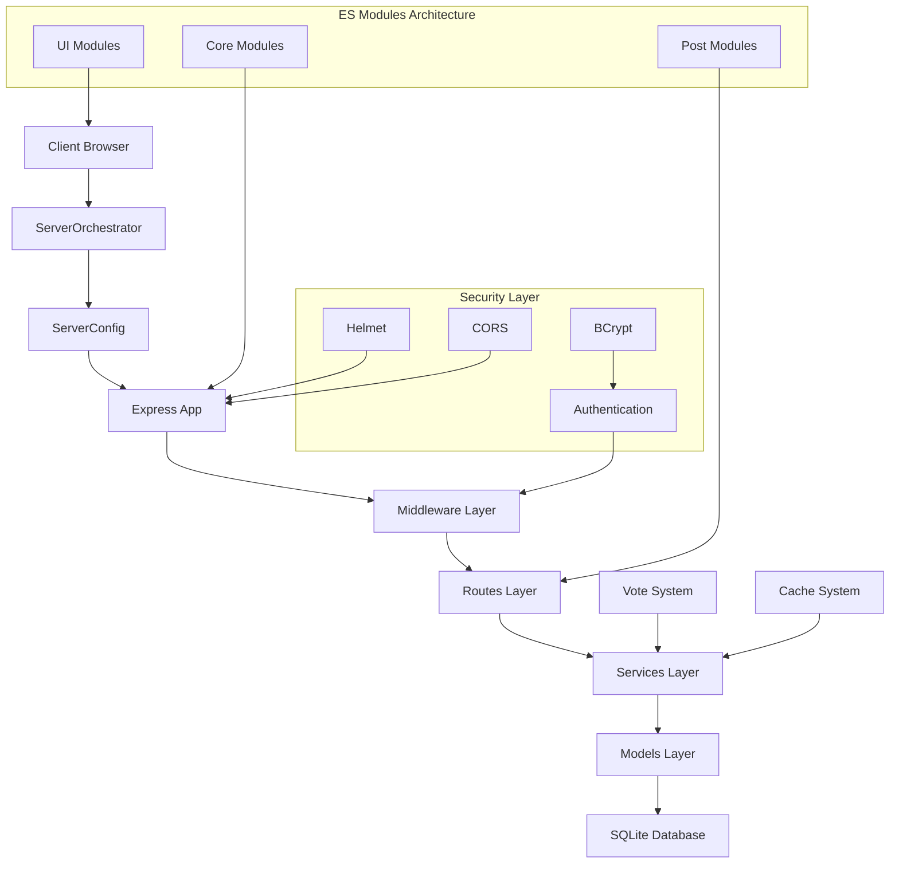
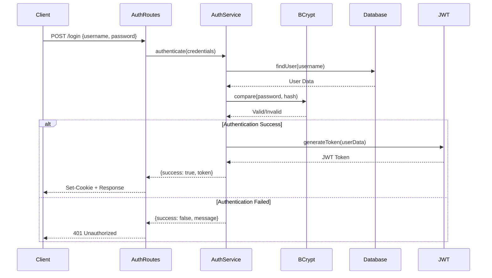
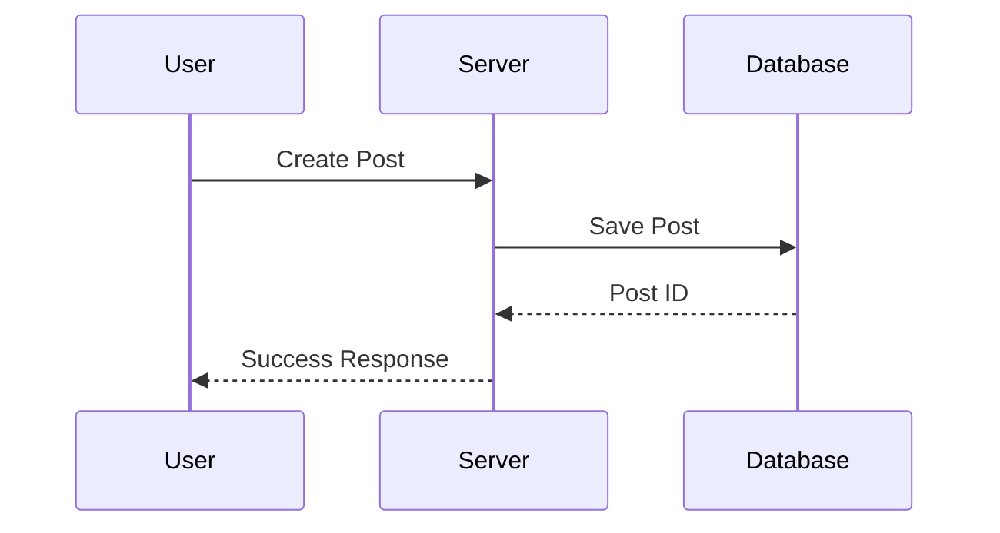
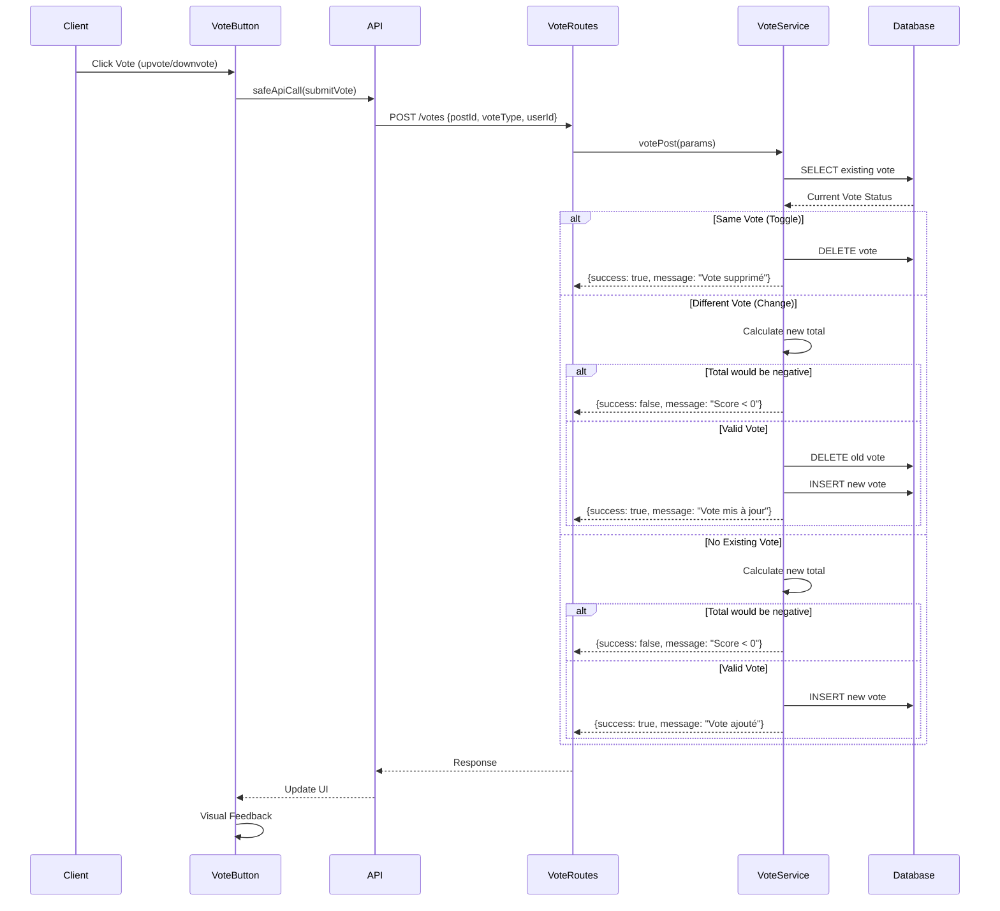
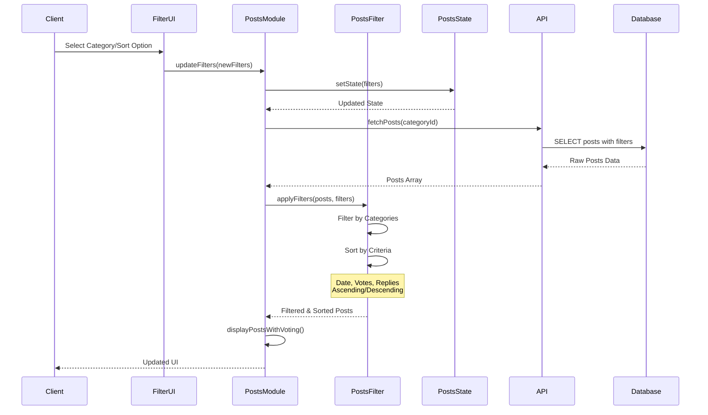
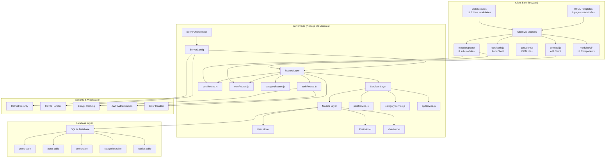
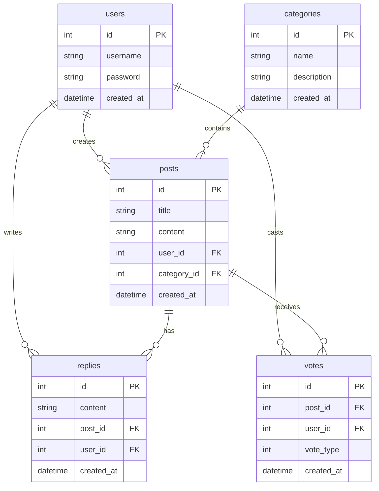
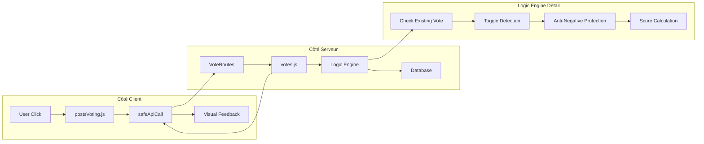

# Architecture Technique

## Architecture Globale Moderne


## Flux d'Authentification JWT



## Flux de Gestion des Posts



## Flux du Système de Votes Intelligent



## Flux du Système de Filtres Avancé



## Architecture des Modules ES6



## Schéma de la Base de Données



## Composants Principaux de l'Architecture

### 🏗️ Core Modules (Fondamentaux)
- **`core/api.js`** : Client API avec `safeApiCall()` et gestion d'erreurs
- **`core/auth.js`** : Authentification côté client avec JWT
- **`core/dom.js`** : Utilitaires DOM optimisés et réutilisables

### 🔧 Server Architecture
- **`server/index.js`** : `ServerOrchestrator` - Point d'entrée principal
- **`server/config/serverConfig.js`** : Configuration Express + middleware
- **`startServer.js`** : Export principal du serveur

### 🛣️ Routes (Express RESTful)
- **`authRoutes.js`** : Login, register, logout avec JWT
- **`postRoutes.js`** : CRUD posts avec validation
- **`voteRoutes.js`** : API de vote intelligent (POST /votes)
- **`categoryRoutes.js`** : Gestion catégories
- **`replyRoutes.js`** : Système de réponses
- **`errorRoutes.js`** : Gestion globale des erreurs 404

### 🔄 Services (Business Logic)
#### Services Serveur
- **`apiService.js`** : Logique API principale
- **`categoryService.js`** : Gestion des catégories
- **`postService.js`** : Services posts de base

#### Services Client
- **`client/postManagerService.js`** : Gestion posts côté client
- **`client/categoryManagerService.js`** : Interface catégories
- **`client/formHandlerService.js`** : Traitement formulaires

#### Services Posts Spécialisés
- **`posts/postCrudService.js`** : CRUD avancé
- **`posts/postQueryService.js`** : Requêtes complexes
- **`posts/postOwnershipService.js`** : Gestion des droits

### 📝 Modules Posts (8 sous-modules)
- **`posts/index.js`** : Orchestrateur principal
- **`posts/postsState.js`** : Gestion d'état centralisée
- **`posts/postsDataLoader.js`** : Chargement données avec cache
- **`posts/postsDisplay.js`** : Rendu et affichage DOM
- **`posts/postsFilter.js`** : Logique de filtrage avancé
- **`posts/postsEventHandlers.js`** : Gestionnaires d'événements
- **`posts/postsActions.js`** : Actions CRUD utilisateur
- **`posts/postsVoting.js`** : Interface de vote réactive

### 🎨 UI Modules
- **`ui/postRenderer.js`** : Rendu des posts
- **`ui/messageHandler.js`** : Gestion des messages
- **`ui/selectPopulator.js`** : Population des selects

### 🔒 Middleware & Sécurité
- **`middleware/authMiddleware.js`** : Vérification JWT
- **`middleware/errorHandler.js`** : Gestionnaire d'erreurs global
- **Helmet** : Protection HTTP headers
- **CORS** : Cross-Origin Resource Sharing
- **BCrypt** : Hachage sécurisé des mots de passe

### 💾 Database Layer
- **`database/connection.js`** : Connexion SQLite
- **`database/schemas/`** : Structures de données (user, post, category)
- **`database/migrations/`** : Scripts de migration
- **`models/`** : Modèles et requêtes SQL préparées

### 📄 Pages Scripts
- **9 scripts spécialisés** : home.js, login.js, posts.js, etc.
- **Logique page spécifique** : Initialisation et comportements

## ⭐ Architecture du Système de Vote

### Double Architecture (Client + Serveur)



### Logique Intelligence

1. **Toggle Detection** : Même vote = suppression
2. **Change Detection** : Vote différent = changement direct
3. **Anti-Negative** : Protection score < 0
4. **Feedback Real-time** : UI mise à jour immédiate

## 🏛️ Patterns Architecturaux

### ES Modules Pattern
```javascript
// Export nommé moderne
export class ServerOrchestrator {
  async initialize() { /* ... */ }
}

// Import sélectif
import { votePost } from "./votes.js";
```

### Service Layer Pattern
```javascript
// Séparation des responsabilités
Routes → Services → Models → Database
```

### Observer Pattern
```javascript
// Événements personnalisés
window.dispatchEvent(new CustomEvent("api-error", {
  detail: { error, operation, message }
}));
```

### Module Pattern
```javascript
// Encapsulation et exports
export {
  initializePosts,
  refreshPosts as updateFilters
};
```

### Middleware Pattern
```javascript
// Pipeline de traitement
app.use(helmet());
app.use(cors());
app.use(authMiddleware);
```

## 🔄 Flux de Données

### Unidirectional Data Flow
```
User Action → State Update → UI Render → Server Sync
```

### State Management
- **Centralisé** : `postsState.js`
- **Persistant** : Session storage
- **Réactif** : Mises à jour automatiques

[Retour au README principal](../README.md) 
