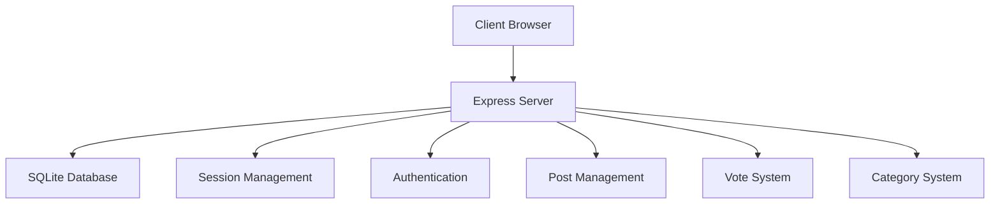
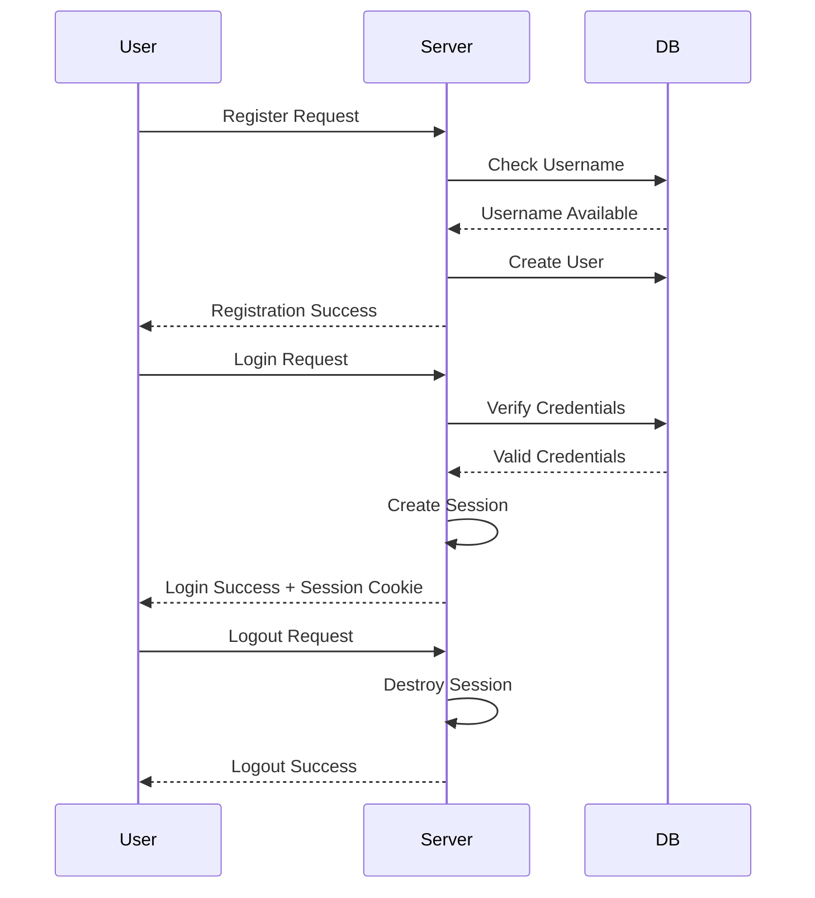
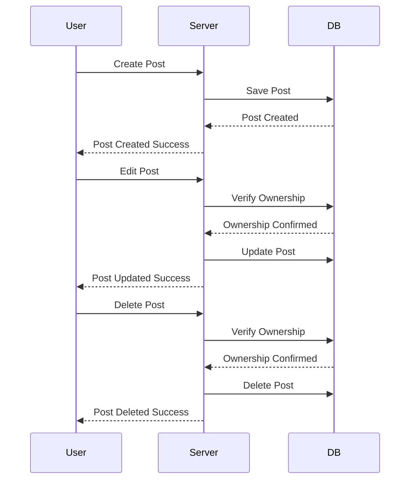
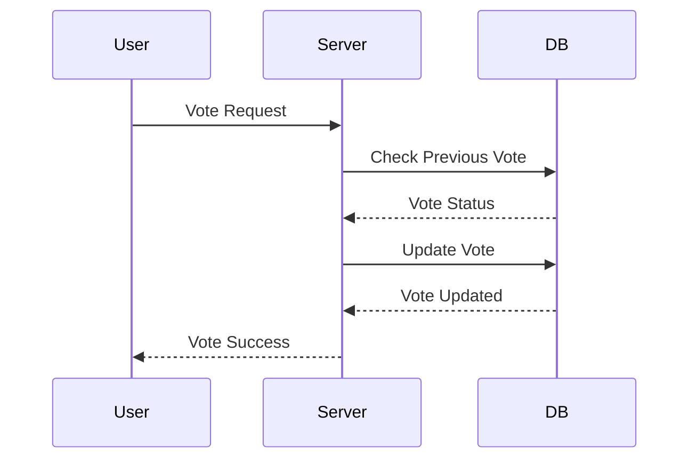

# Architecture Technique

## Diagramme d'Architecture Global

## Gestion des Sessions et Authentification

## Gestion des Posts

## Système de Votes

## Composants Principaux

### Core Module
- `api.js` : Gestion centralisée des appels API
- `auth.js` : Logique d'authentification
- `dom.js` : Utilitaires de manipulation DOM

### Middleware
- `authMiddleware.js` : Protection des routes
- `errorHandler.js` : Gestion globale des erreurs

### Base de Données
- SQLite pour la persistance
- Tables optimisées
- Requêtes préparées
- Transactions

[Retour au README principal](../README.md) 