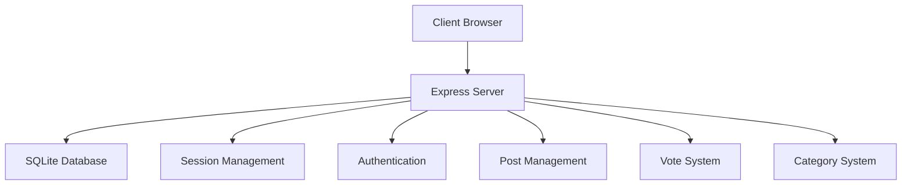
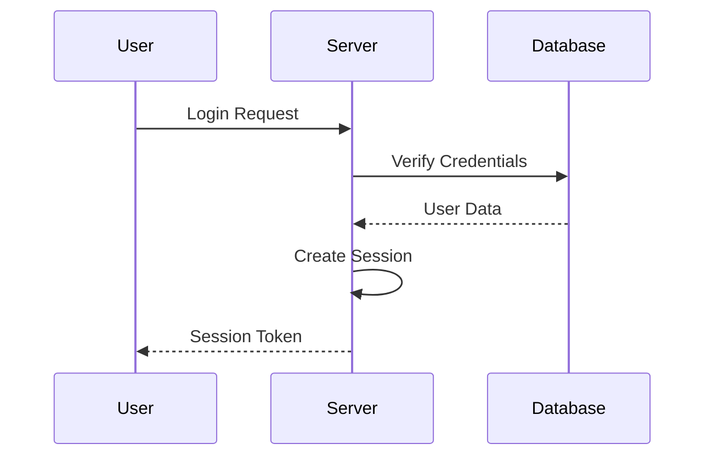
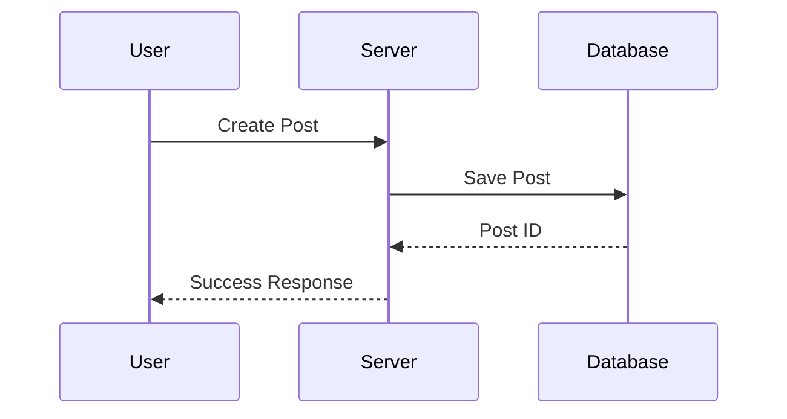
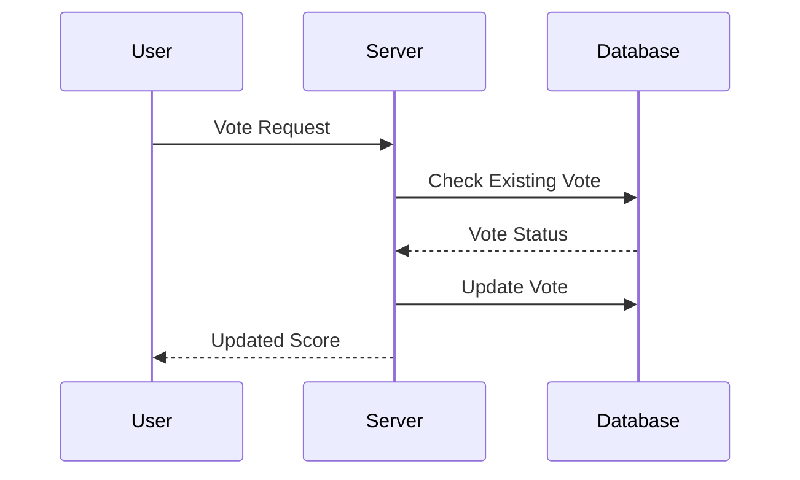
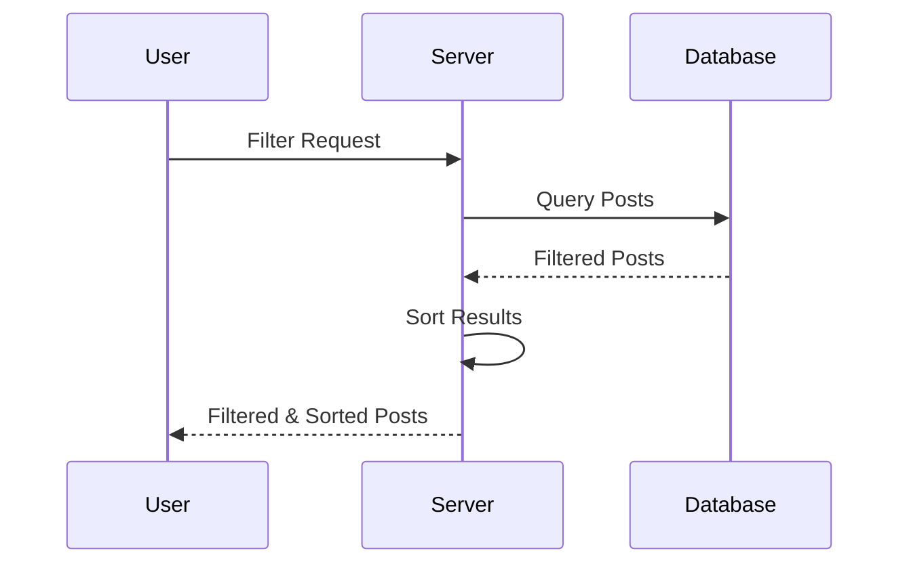
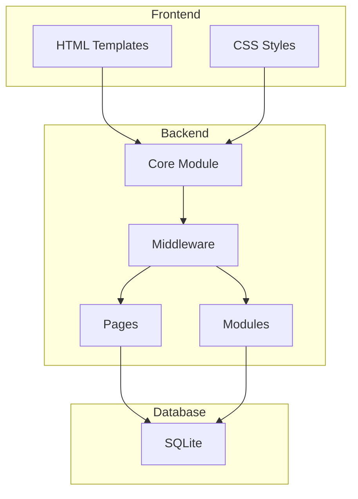
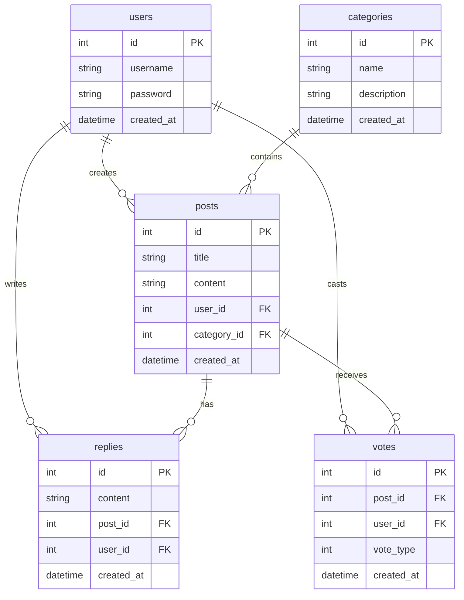

# Architecture Technique

## Architecture Globale

## Flux d'Authentification

## Flux de Gestion des Posts

## Flux du Système de Votes

## Flux du Système de Filtres

## Architecture des Modules

## Schéma de la Base de Données

## Composants Principaux

### Modules Core
- `api.js` : Configuration des routes API
- `auth.js` : Gestion de l'authentification
- `posts.js` : Gestion des posts
- `votes.js` : Système de votes
- `categories.js` : Gestion des catégories
- `index.js` : Système de filtrage et tri

### Middleware
- `auth.js` : Middleware d'authentification
- `error.js` : Gestion des erreurs
- `validation.js` : Validation des données

[Retour au README principal](../README.md) 

