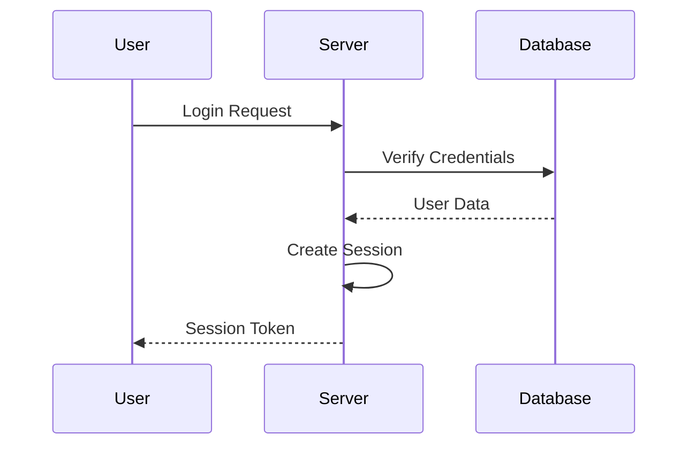
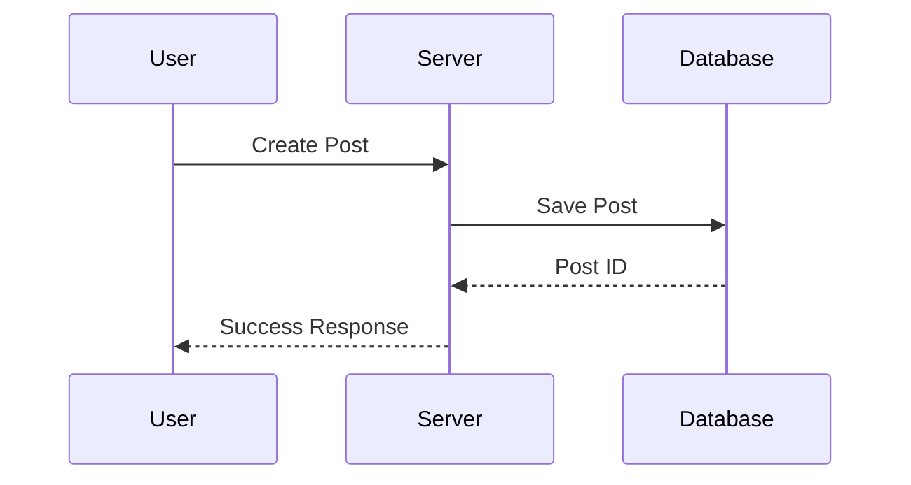
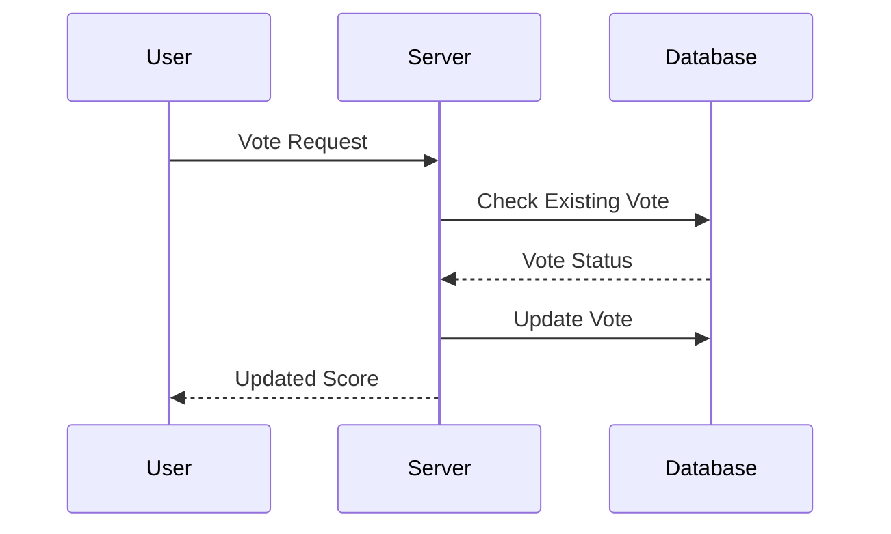
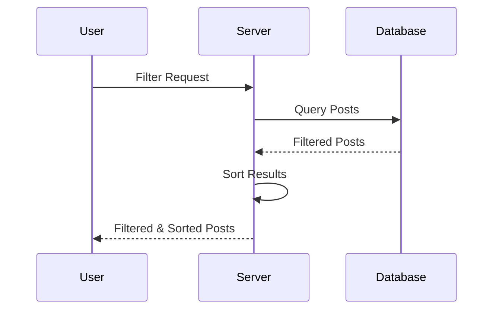
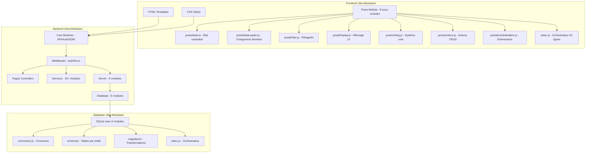
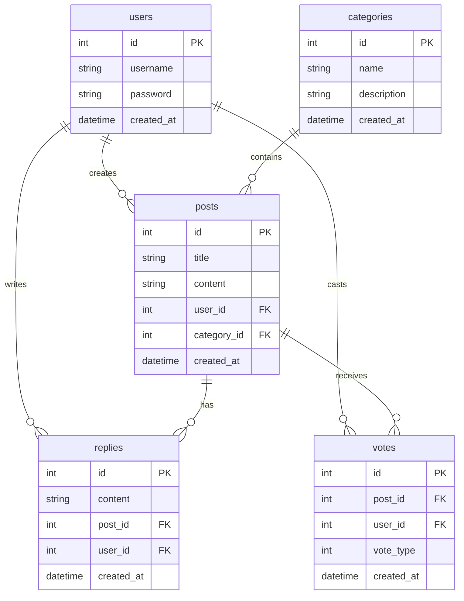

# Architecture Technique

## Architecture Globale Ultra-Modulaire

```mermaid
graph TD
    A[Client Browser] --> B[Express Server Ultra-Modulaire]
    B --> C[SQLite Database Ultra-Modulaire]
    B --> D[Session Management]
    B --> E[Authentication Core]
    B --> F[Posts Module Ultra-Spécialisé]
    B --> G[Vote System]
    B --> H[Category System]
    
    subgraph "Frontend Modules"
        F1[postsState.js - 67 lignes]
        F2[postsDataLoader.js - 61 lignes]
        F3[postsFilter.js - 47 lignes]
        F4[postsDisplay.js - 115 lignes]
        F5[postsVoting.js - 78 lignes]
        F6[postsActions.js - 227 lignes]
        F7[postsEventHandlers.js - 48 lignes]
        F8[index.js - 42 lignes Orchestrateur]
    end
    
    subgraph "Database Modules"
        C1[connection.js - 45 lignes]
        C2[userSchema.js - 84 lignes]
        C3[categorySchema.js - 45 lignes]
        C4[postSchema.js - 77 lignes]
        C5[userMigrations.js - 66 lignes]
        C6[index.js - 76 lignes Orchestrateur]
    end
    
    subgraph "Server Modules"
        B1[serverConfig.js - 62 lignes]
        B2[pageRoutes.js - 53 lignes]
        B3[authRoutes.js - 57 lignes]
        B4[postRoutes.js - 9 lignes Orchestrateur]
        B5[voteRoutes.js - 71 lignes]
        B6[replyRoutes.js - 66 lignes]
        B7[categoryRoutes.js - 38 lignes]
        B8[errorRoutes.js - 22 lignes]
        B9[index.js - 67 lignes Orchestrateur]
    end
    
    F --> F1
    F --> F2
    F --> F3
    F --> F4
    F --> F5
    F --> F6
    F --> F7
    F --> F8
    
    C --> C1
    C --> C2
    C --> C3
    C --> C4
    C --> C5
    C --> C6
    
    B --> B1
    B --> B2
    B --> B3
    B --> B4
    B --> B5
    B --> B6
    B --> B7
    B --> B8
    B --> B9
```

## Flux d'Authentification

## Flux de Gestion des Posts

## Flux du Système de Votes

## Flux du Système de Filtres

## Architecture des Modules Ultra-Modulaire

## Optimisations Réalisées

### Réductions de Code Massives
- **database.js** : 215 → 8 lignes (-96%)
- **startServer.js** : 481 → 11 lignes (-98%) 
- **posts module** : 718 → 42 lignes (-94%)
- **postRoutes.js** : 227 → 9 lignes (-96%)

### Total : 1641 → 70 lignes (-96% global)

### Modules Créés : 40+ modules ultra-spécialisés

## Schéma de la Base de Données

## Composants Principaux Ultra-Modulaires

### Modules Core (3 modules)
- `api.js` : Gestion centralisée des appels API
- `auth.js` : Authentification et sessions
- `dom.js` : Utilitaires DOM optimisés

### Database Ultra-Modulaire (6 modules)
- `connection.js` : Gestion connexion (45 lignes)
- `userSchema.js` : Tables utilisateurs (84 lignes)
- `categorySchema.js` : Tables catégories (45 lignes)
- `postSchema.js` : Tables posts/réponses/votes (77 lignes)
- `userMigrations.js` : Migrations utilisateurs (66 lignes)
- `index.js` : Orchestrateur principal (76 lignes)

### Server Ultra-Modulaire (8 modules)
- `serverConfig.js` : Configuration Express (62 lignes)
- `pageRoutes.js` : Routes pages statiques (53 lignes)
- `authRoutes.js` : Routes authentification (57 lignes)
- `postRoutes.js` : Orchestrateur posts (9 lignes)
- `voteRoutes.js` : Routes votes (71 lignes)
- `replyRoutes.js` : Routes réponses (66 lignes)
- `categoryRoutes.js` : Routes catégories (38 lignes)
- `errorRoutes.js` : Gestion erreurs (22 lignes)

### Posts Routes Ultra-Spécialisé (4 modules)
- `postReadRoutes.js` : Operations GET (70 lignes)
- `postCreateRoutes.js` : Opérations POST (51 lignes)
- `postUpdateRoutes.js` : PUT/DELETE (82 lignes)
- `postAuthHelper.js` : Helper auth (14 lignes)

### Frontend Posts Ultra-Modulaire (8 modules)
- `postsState.js` : État centralisé (67 lignes)
- `postsDataLoader.js` : Chargement données (61 lignes)
- `postsFilter.js` : Filtrage et tri (47 lignes)
- `postsDisplay.js` : Génération UI (115 lignes)
- `postsVoting.js` : Système votes (78 lignes)
- `postsActions.js` : Actions CRUD (227 lignes)
- `postsEventHandlers.js` : Événements (48 lignes)
- `index.js` : **Orchestrateur principal (42 lignes)**

### Services Métier (15+ modules)
Services spécialisés pour la logique métier complexe organisés par domaine.

### Middleware Express (2 modules)
- `authMiddleware.js` : Protection des routes
- `errorHandler.js` : Gestion globale des erreurs

### Points d'Entrée Optimisés
- `database.js` : **8 lignes** (était 215 lignes)
- `startServer.js` : **11 lignes** (était 481 lignes)
- `posts.js` : **78 lignes** (était 324 lignes)

### Architecture Hyper-Modulaire
- **40+ modules spécialisés** créés
- **Aucun fichier > 227 lignes**
- **Orchestrateurs ultra-légers**
- **Séparation parfaite des responsabilités**

[Retour au README principal](../README.md) 

